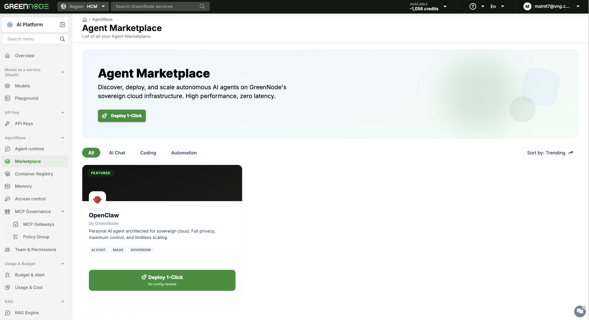
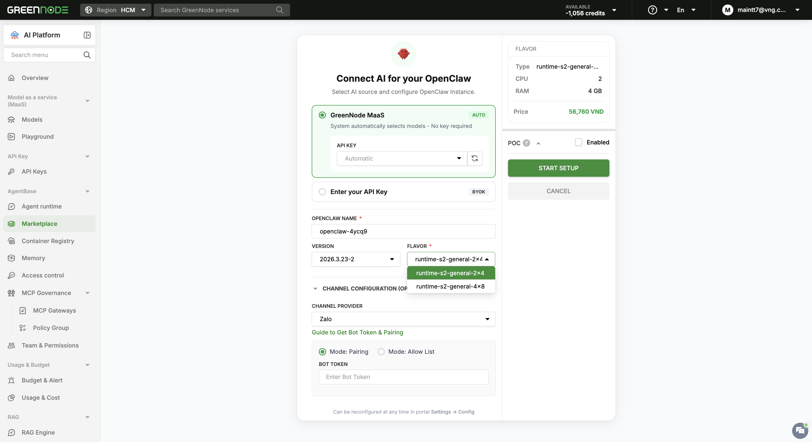
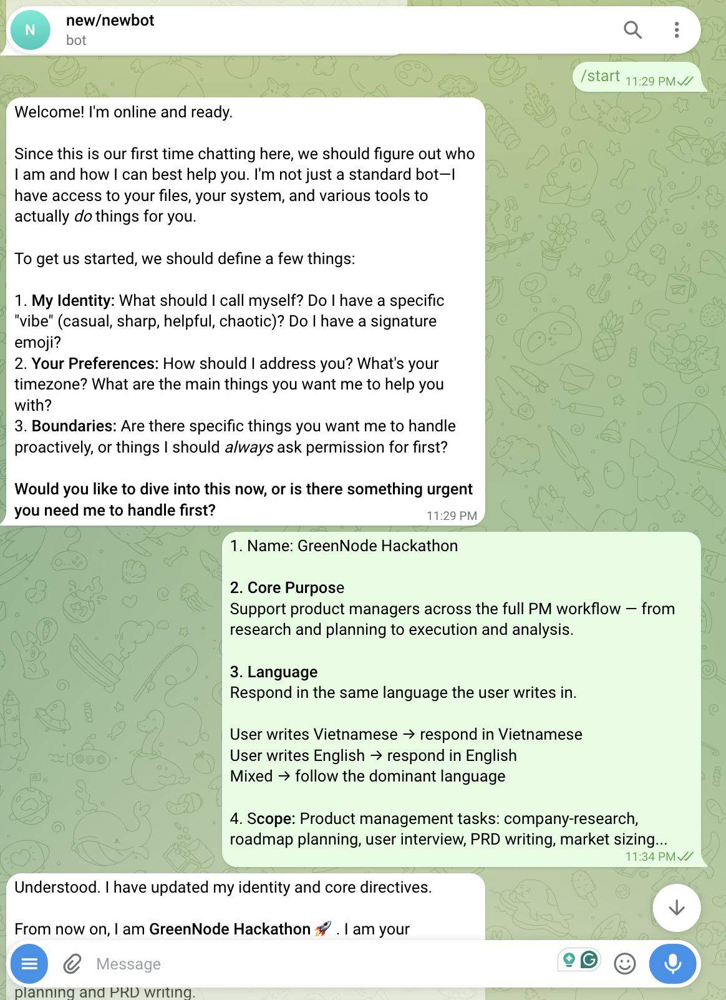
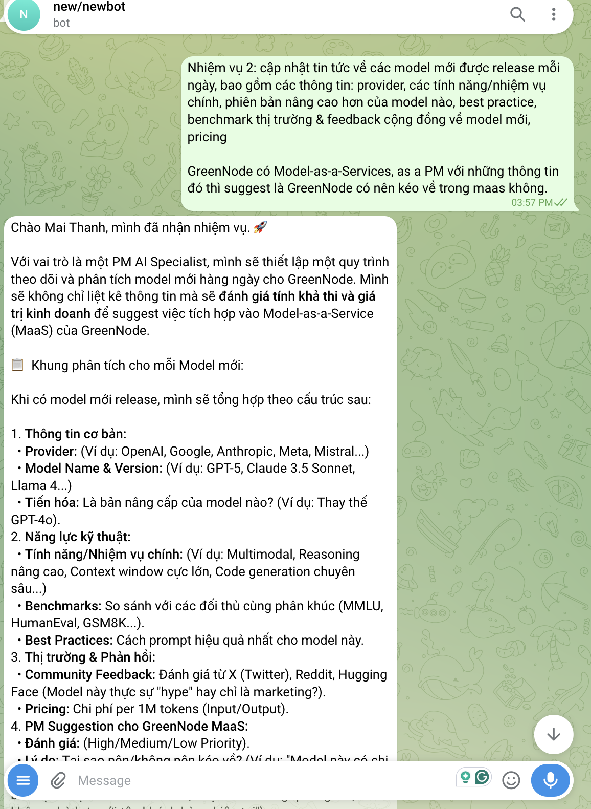

# GreenNode PM Assistant

> An AI Product Management specialist built on OpenClaw. Created in one click on the GreenNode AgentBase runtime, it lives on GreenNode infrastructure and uses GreenNode MaaS out of the box — supporting a PM across the full workflow from research to delivery, available 24/7 over Telegram.

---

## Demo

[Watch the demo](https://vngms.sharepoint.com/:v:/s/CLSSMC/IQDpFLUrnUSDRYrweGfsm52BAb7oYHMl5mya6RZoGi7jWy0)

---

## Problem

A Product Manager carries a wide, fragmented workload — market and competitor research, roadmap planning, user interviews, PRD writing, market sizing. Each task means pulling from many sources, synthesizing by hand, and switching between disconnected tools.

Two pain points recur:

1. **Research is slow and gets deprioritized.** Tracking the market, competitors, and new technology takes hours a day, and it is the first thing dropped when the PM is busy.
2. **Context is lost between sessions.** Notes, decisions, and prior research live in scattered places, so every task starts from scratch.

The result: product decisions are made later and with less grounding than they should be.

---

## Users

| Who                                       | How they use it                                                                                                                            |
| ----------------------------------------- | ------------------------------------------------------------------------------------------------------------------------------------------ |
| **Product Managers**                | A single assistant across the PM workflow — ask it to research, draft a PRD, plan a roadmap, or prepare interview questions, all in chat. |
| **BA / Strategy / Marketing / Ops** | Anyone who works with research, documents, and market tracking can adapt the same assistant to their domain.                               |
| **The whole team**                  | Receives scheduled market and model updates pushed to Telegram, with analysis and recommendations rather than raw links.                   |

No coding required — the agent is used entirely through chat.

---

## Solution

The assistant is a general-purpose PM partner: it understands a request, looks information up on its own to answer, and acts — instead of replying from a fixed script like an ordinary chatbot. Its core skills:

### Company & Market Research

Researches companies, products, trends, and competitor moves. Searches the web, fetches sources, and returns a synthesized summary instead of a list of links.

### Roadmap Planning

Helps draft, prioritize, and structure a product roadmap from a goal or a backlog of ideas.

### User Interview Support

Prepares interview question sets and survey frames, and consolidates findings into insights.

### PRD Writing

Drafts and refines Product Requirement Documents from a brief.

### Market Sizing

Estimates market size (TAM / SAM / SOM) on request, showing assumptions and method.

### Proactive Market & Model Tracking

On a schedule, it sweeps AI news and new model releases, filters the most relevant updates for a PM, analyzes what each means for GreenNode with an Adopt / Adapt / Alert recommendation, and pushes the report to Telegram — without anyone triggering it.

### Foundational capabilities

- **Multilingual** — replies in the language the user writes in (Vietnamese / English / mixed).
- **Persistent memory** — keeps context across sessions through its workspace files (`SOUL.md`, `USER.md`, `MEMORY.md`, daily notes); it gets to know the user the more it is used.
- **Proactive scheduling** — heartbeats and scheduled jobs let it work and check in on its own.
- **Flexible channels** — chat with it directly in the OpenClaw interface, or connect a messaging channel such as Zalo or Telegram to talk to it and receive reports where the team already works.

---

## How It Is Built — OpenClaw one-click

Unlike agents that are coded, packaged, and deployed from a repository, this agent is created **directly in one click on the GreenNode runtime**:

- Once created, it **already runs on GreenNode infrastructure** — no servers, no Dockerfile, no deploy pipeline.
- It **uses GreenNode MaaS out of the box** — no model endpoints or keys to wire up.
- Its behavior is defined by **workspace files (Markdown)** rather than source code, so a non-technical PM can read and adjust it.

The agent is interacted with entirely through chat — **directly in the OpenClaw interface, or through a connected channel such as Zalo or Telegram**.

### Workspace structure

OpenClaw is configured through Markdown files in its workspace, not source code:

```
.openclaw/
├── openclaw.json              # Runtime config, MaaS models, Telegram channel, tools
└── workspace/
    ├── IDENTITY.md            # Who the agent is (name, PM Specialist role)
    ├── SOUL.md                # Personality, operating principles, multilingual behavior
    ├── USER.md                # The user's profile (the PM)
    ├── AGENTS.md              # Workspace rules, memory, heartbeat, red lines
    ├── TOOLS.md               # Environment-specific notes
    ├── HEARTBEAT.md           # Recurring task checklist
    ├── PM_MARKET_RESEARCH.md  # Recurring market-research workflow
    └── memory/                # Persistent memory (daily notes, model tracking)
```

---

## Guide — Deploy & Set Up on GreenNode OpenClaw 1-Click

Building this agent takes no coding. The whole setup is done in the GreenNode portal and then by chatting with the agent.

### Step 1 — Open the Agent Marketplace and deploy 1-Click

Go to the GreenNode AI Platform portal at [aiplatform.console.vngcloud.vn/agent-marketplace](https://aiplatform.console.vngcloud.vn/agent-marketplace), find **OpenClaw**, and click **Deploy 1-Click**.



### Step 2 — Choose the configuration and channel, then start setup

The agent comes **already integrated with GreenNode MaaS** — models are selected automatically, with no API key to configure. Just pick the **instance flavor** (CPU / RAM) that fits your agent, and choose the **messaging channel** you want to talk to it on, such as **Zalo** or **Telegram** (pairing mode + bot token). Then click **START SETUP**.

For a more detailed walkthrough, see the official docs: [OpenClaw 1-Click setup guide](https://docs.vngcloud.vn/vng-cloud-document/ai-stack/agent-base/agent-runtime/openclaw/openclaw-1-click).



### Step 3 — Build the agent's identity (SOUL.md)

On the first chat, define who the agent is: the role you want it to help with, and your preferences for language, communication style, and boundaries. Just describe what you want in plain language — the agent writes it into its identity (`SOUL.md`), and you can adjust it anytime later.



### Step 4 — Give it tasks and add skills

Assign the agent tasks — including recurring ones it runs automatically on a schedule — and add any skills you want it to have.



---

## Benefits of Running on AgentBase

### Always on — 24/7

The agent lives on GreenNode infrastructure, not a personal machine. A locally run agent stops the moment the laptop is closed; here it stays online and keeps working.

### One click, no infrastructure to manage

Created on the GreenNode runtime and ready to run — no server provisioning, Dockerfile, or deploy process to maintain.

### GreenNode MaaS

Self-hosted models are available immediately; there are no endpoints or API keys to configure.

### Scheduled work runs in the background

Heartbeats and scheduled jobs run even when the user is offline, then deliver results to Telegram.

### Reachable anywhere

The PM interacts through the OpenClaw interface, a connected channel (Zalo / Telegram) from any device.
