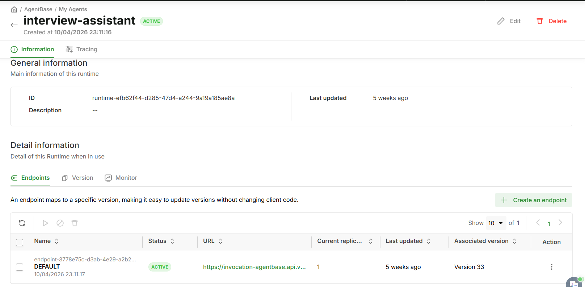
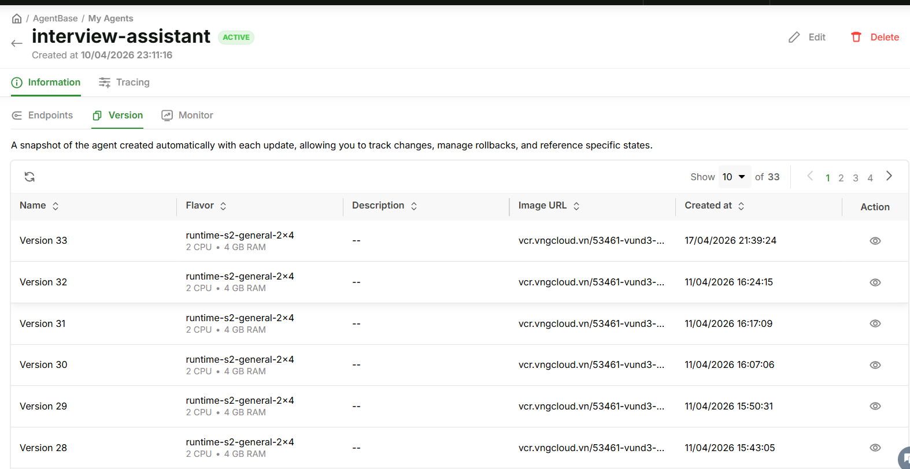
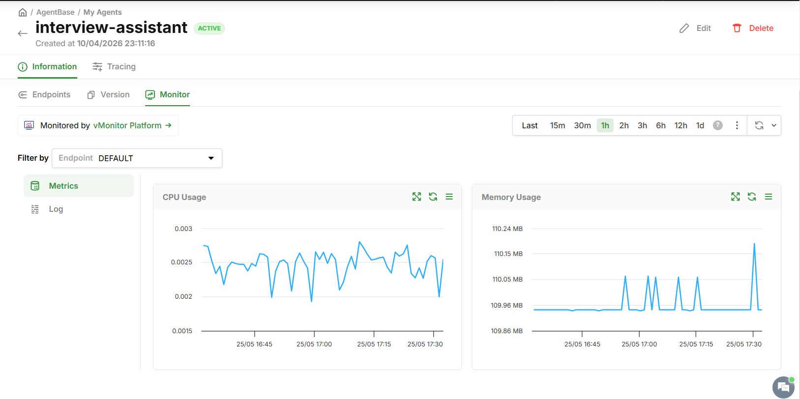
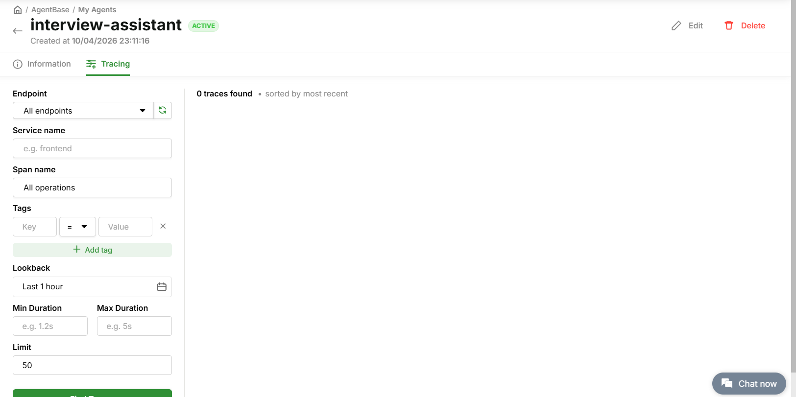

# GreenNode Interview Assistant

> An AI-powered interview tool that transcribes conversations in real-time, generates tailored questions from a candidate's CV, and produces a structured assessment report — so interviewers can focus on the person, not the paperwork.

---

## Demo

[](https://vngms.sharepoint.com/:v:/s/CLSSMC/IQC-I2D-cZ2vTLmDP0G7uqxrAeg9G32YLV6G44lg1XOfUGA?nav=eyJyZWZlcnJhbEluZm8iOnsicmVmZXJyYWxBcHAiOiJTdHJlYW1XZWJBcHAiLCJyZWZlcnJhbFZpZXciOiJTaGFyZURpYWxvZy1MaW5rIiwicmVmZXJyYWxBcHBQbGF0Zm9ybSI6IldlYiIsInJlZmVycmFsTW9kZSI6InZpZXcifX0%3D&e=t9Hqcc)

---

## Problem

Technical interviews at GreenNode (and most companies) have two recurring pain points:

1. **The interviewer is doing too many things at once.** Listening, asking follow-ups, taking notes, and evaluating — all at the same time. Something gets missed.
2. **Assessment is inconsistent.** Different interviewers ask different questions, score on different scales, and produce reports in different formats. Hiring decisions become hard to compare or defend.

The result: good candidates slip through, bad hires happen, and every debrief starts with "I forgot to ask about X."

---

## Users

| Who | How they use it |
|-----|----------------|
| **Technical interviewers** | Upload CV + JD before the call, get a tailored question list. Focus on the conversation while audio is transcribed live. |
| **Recruiters / HR** | Download a scored Excel report after every interview. No manual note-taking required. |
| **Hiring managers** | Review consistent, structured assessments across all candidates for a role. |

---

## Solution

The assistant handles three phases of an interview automatically:

### 1. Preparation — tailored questions from the CV
Upload the candidate's CV (PDF/DOCX/TXT) and the Job Description. **gemma-4-31b-it** reads both documents, identifies skill gaps and overlaps, and generates **9 interview questions** following GreenNode's assessment framework:

- **3 Functional Skill questions** — grounded in the candidate's actual experience and the JD requirements
- **3 GreenNode DNA questions** — Collaboration, Continuous Learning, Customer-Centric
- **3 Motivation questions** — Who You Are / How You Think / What You Commit

Each question comes with a follow-up probe and a hint for what a strong answer looks like.

### 2. During the interview — live transcription
The browser captures microphone audio and streams it to a local WebSocket server. The server batches audio in ~8-second chunks and sends them to the **GreenNode MaaS Whisper API** (OpenAI Whisper large-v3). Transcribed text appears in the UI in near-real-time. The interviewer reads the questions on screen, has a conversation, and the full transcript builds itself.

### 3. After the interview — automated assessment + Excel report
Click "Assess". **gemma-4-31b-it** reads the full transcript against GreenNode's 9-criterion rubric, scores each criterion 1–5 with evidence quotes from the transcript, calculates a total score, and outputs a hiring recommendation (HIRE / CONSIDER / NOT PROCEED). The result is saved as a formatted Excel file ready to share.

### Architecture

```
Browser (frontend/)
  │  ← drag-drop CV/JD, live transcript display, question panel
  │
  ├── HTTP (port 8000) ──→ FastAPI (interview/app.py)
  │                            ├── /api/extract-info    → gemma-4-31b-it: extract name/position
  │                            ├── /api/generate-questions → gemma-4-31b-it: question generation
  │                            ├── /api/assess          → gemma-4-31b-it: scoring + Excel output
  │                            └── /api/download/{id}   → download .xlsx
  │
  └── WebSocket (port 9090) ──→ run_interview.py
                                    └── whisper_live/backend/maas_backend.py
                                            └── GreenNode MaaS Whisper API
```

Both LLM and Whisper calls go through **GreenNode MaaS** — one `AI_PLATFORM_API_KEY` covers everything.

---

## How to Run

### Prerequisites

- Python 3.9+
- GreenNode MaaS API key (`AI_PLATFORM_API_KEY`)

### 1. Clone and install

```bash
git clone <repo-url>
cd interview-assistant
pip install -e ".[dev]"
```

### 2. Configure environment

```bash
cp .env.example .env
```

Edit `.env` — chỉ cần điền API key:

```env
AI_PLATFORM_API_KEY=your-api-key-here
WHISPER_API_KEY=your-api-key-here
WHISPER_BASE_URL=https://maas-llm-aiplatform-hcm.api.vngcloud.vn/v1
```

### 3. Start the server

```bash
python run_interview.py
```

This starts two servers:
- **HTTP server** at `http://localhost:8000` — the web UI
- **WebSocket server** at `ws://localhost:9090` — live transcription

### 4. Open the UI

Go to `http://localhost:8000` in your browser.

**Interview flow:**

1. Upload the candidate's CV
2. Upload the Job Description (optional but recommended)
3. Click "Generate Questions" — gemma-4-31b-it generates 9 tailored questions
4. Start the interview — click "Start Recording"
5. Ask questions; watch transcript appear in real-time
6. Stop recording when done
7. Click "Assess" — gemma-4-31b-it scores the transcript
8. Download the Excel report

### Optional: Docker

```bash
docker build -f docker/Dockerfile.cpu -t interview-assistant .
docker run -p 8000:8000 -p 9090:9090 --env-file .env interview-assistant
```

---

## Deploy to AgentBase

Chạy local là bước đầu. Để agent hoạt động **production** với endpoint ổn định, identity riêng, memory, và monitoring tích hợp — deploy lên **GreenNode AgentBase**.

### Dùng AgentBase Skills

[**greennode-agentbase-skills**](https://github.com/vngcloud/greennode-agentbase-skills) là bộ skill dành riêng cho Claude Code, hỗ trợ toàn bộ lifecycle: scaffold → config → deploy → monitor → teardown.

**Thêm skill vào project:**

```bash
echo "https://github.com/vngcloud/greennode-agentbase-skills" >> .claude/SKILLS.md
```

**Các lệnh chính:**

```
/agentbase-wizard init     # Scaffold cấu hình AgentBase cho project
/agentbase-identity        # Cấu hình tên, system prompt, personality của agent
/agentbase-deploy          # Build Docker image, push lên GreenNode Container Registry, tạo runtime
/agentbase-monitor         # Xem logs, CPU/Memory, distributed traces
```

---

### Lợi ích khi chạy trên AgentBase

#### Endpoint ổn định — URL không đổi khi update version

Mỗi agent có một **DEFAULT endpoint** với URL cố định. Deploy version mới — URL vẫn giữ nguyên, client không cần đổi config.



---

#### Version control tự động — rollback bất kỳ lúc nào

Mỗi lần deploy tạo ra một **snapshot version** tự động. Xem lịch sử, so sánh, hoặc rollback về version cũ chỉ bằng vài click. Agent này đang chạy `runtime-s2-general-2x4` (2 CPU · 4 GB RAM).



---

#### Monitoring tích hợp — CPU, Memory, Logs, Tracing

AgentBase tích hợp sẵn **vMonitor Platform**: CPU Usage, Memory Usage theo thời gian thực, truy vết từng request qua Distributed Tracing — không cần setup thêm công cụ observability.





---

#### Agent Identity — tên, system prompt, personality riêng

Dùng `/agentbase-identity` để đặt tên agent, mô tả, và system prompt mặc định. Identity được lưu trên AgentBase và áp dụng cho mọi request — không cần truyền system prompt từng lần trong code.

---

#### Memory — lưu lịch sử hội thoại giữa các phiên

AgentBase hỗ trợ conversation memory: lịch sử hội thoại được lưu lại theo `session_id`, agent có thể nhớ context từ các lượt trước trong cùng phiên phỏng vấn — không cần tự quản lý state ở client.

---

## What to Customize

### Change the assessment criteria

The scoring rubric is defined in [interview/assessment.py](interview/assessment.py) as `ASSESSMENT_PROMPT`. Edit the text there to:

- Change the 1–5 scoring descriptions
- Replace GreenNode DNA criteria with your company's values
- Adjust the HIRE / CONSIDER / NOT PROCEED thresholds (currently: ≥3.0 → HIRE, ≥2.5 → CONSIDER)

### Change the question framework

The question generation prompt is in [interview/question_generator.py](interview/question_generator.py) as `QUESTION_PROMPT`. Edit it to:

- Add more question categories or change the 3-3-3 split
- Replace the sample question bank with your own
- Add domain-specific question templates (e.g., for engineering, sales, ops)

### Change the output language

Both prompts instruct the model to respond in Vietnamese. To switch to English, find and replace `"TIẾNG VIỆT"` / `"bằng tiếng Việt"` in both files.

### Change the LLM model

In `.env`, set `LLM_MODEL` to any model available on GreenNode MaaS:

```env
LLM_MODEL=google/gemma-4-31b-it        # default
# LLM_MODEL=qwen2.5-72b-instruct       # multilingual alternative
# LLM_MODEL=qwen2.5-coder-32b-instruct # code-focused alternative
```

### Change the Whisper model

In `.env`, update `WHISPER_MODEL`:
- `openai/whisper-large-v3` (default — best accuracy, multilingual)
- `openai/whisper-medium` (faster, slightly lower accuracy)

### Change the Excel report format

The report layout is in [interview/excel_generator.py](interview/excel_generator.py) — column widths, colors, score guides, all via `openpyxl`.

### Change the ports

```bash
python run_interview.py --port 8080 --ws-port 9091
```

---

## Project Structure

```
interview-assistant/
├── run_interview.py          # Entry point — starts both servers
├── .env.example              # Configuration template
│
├── interview/                # Core assistant logic
│   ├── app.py                # FastAPI routes
│   ├── llm_client.py         # GreenNode MaaS LLM client (gemma-4-31b-it)
│   ├── assessment.py         # Transcript scoring via gemma-4-31b-it
│   ├── question_generator.py # Question generation via gemma-4-31b-it
│   └── excel_generator.py    # Excel report builder
│
├── whisper_live/             # Real-time transcription engine
│   └── backend/
│       └── maas_backend.py   # GreenNode MaaS Whisper integration
│
└── frontend/                 # Web UI
    ├── index.html
    ├── app.js
    └── style.css
```

---

## How GreenNode MaaS is Used

All AI calls go through **GreenNode MaaS** at `https://maas-llm-aiplatform-hcm.api.vngcloud.vn/v1` using the OpenAI-compatible API:

```python
# interview/llm_client.py
from openai import OpenAI

client = OpenAI(
    base_url="https://maas-llm-aiplatform-hcm.api.vngcloud.vn/v1",
    api_key=os.getenv("AI_PLATFORM_API_KEY"),
)
response = client.chat.completions.create(
    model="google/gemma-4-31b-it",
    messages=[{"role": "user", "content": prompt}],
    max_tokens=2000,
    temperature=1,
    top_p=0.7,
    presence_penalty=0,
)
```

**gemma-4-31b-it** handles three tasks:
1. **Extracting candidate name and position** from uploaded documents
2. **Generating the interview question set** from CV + JD
3. **Scoring the transcript** against the 9-criterion rubric and writing the summary

**GreenNode MaaS Whisper** handles real-time audio transcription independently via WebSocket.
